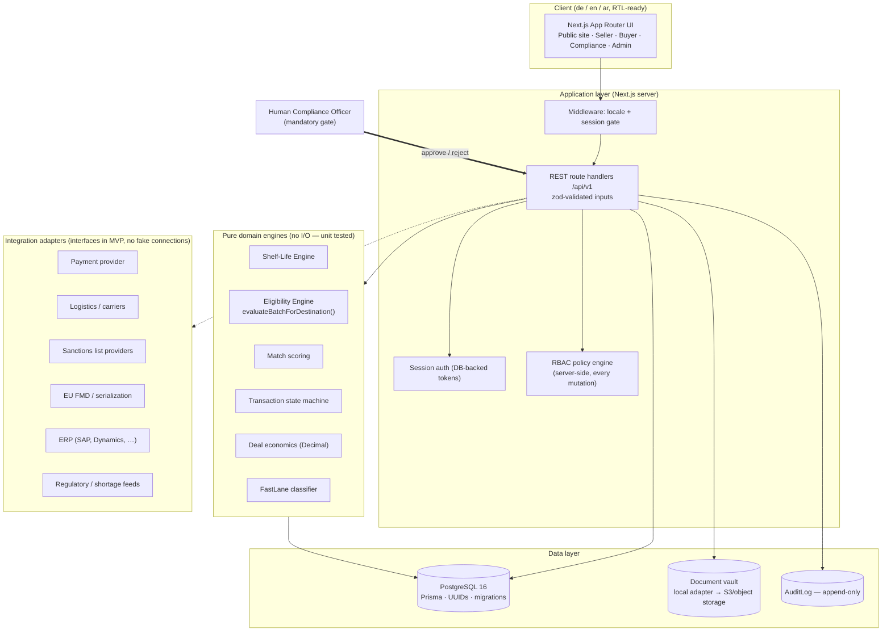

# PART A — Executive Product Architecture

**Working name:** PharmaBridge (isolated in `src/lib/branding.ts` — rename requires one file change)
**Positioning:** A regulated pharmaceutical inventory redistribution and supply-intelligence network.
**Tagline (working):** Move medicines where they are needed. / Medikamente dorthin bewegen, wo sie gebraucht werden.

## 1. What the system is

PharmaBridge is **not** a shop where a seller uploads medicine and anyone buys it. It is a
**Pharmaceutical Regulatory Matching Engine** with a marketplace attached:

```
Batch + Product + Seller license + Buyer license + Destination country
+ Registration status + Import rules + Shelf-life rules + Logistics time
+ Sanctions + Documents
        │
        ▼
ELIGIBLE | CONDITIONALLY_ELIGIBLE | INELIGIBLE | HUMAN_REVIEW_REQUIRED | INSUFFICIENT_DATA
```

Two marketplace categories share the same engine, differing only in shelf-life profile:

| Category | Remaining shelf life (typical) | Behaviour |
|---|---|---|
| **Pharma Surplus** | ~12–36 months | Discounted B2B redistribution of overstock |
| **Short-Dated Pharma** | ~6–12 months | Only visible/tradable where destination rules verifiably permit it |

The threshold between the two is **configuration** (`PlatformConfig.short_dated_threshold_months`, default 12), never hardcoded.

## 2. Non-negotiable safety invariants

These invariants are enforced in the domain layer and covered by tests. No UI, admin, or API path may bypass them.

1. **Eligibility before visibility.** A buyer generally never sees actionable inventory they cannot legally purchase.
2. **No auto-approval under uncertainty.** Any missing, unverified, DEMO, outdated, or conflicting regulatory input degrades the verdict to `HUMAN_REVIEW_REQUIRED` or `INSUFFICIENT_DATA` — never to `ELIGIBLE`.
3. **Human compliance gate.** Every transaction passes `COMPLIANCE_REVIEW`; only a platform Compliance Officer can move it to `READY_FOR_PAYMENT`.
4. **Recalled/quarantined batches are untradable** the moment the flag is set — listings blocked, transactions frozen.
5. **Expired or unverified licenses block regulated actions** (publishing, offering, transacting).
6. **Shelf-life decisions use projected arrival date** (today + shipping + customs buffer + operational buffer), never order date.
7. **Append-only audit.** Compliance-relevant records are never silently mutated; regulatory rules are versioned, never overwritten.
8. **No hallucinated regulation.** Unverified = `NO_VERIFIED_RULE`. Seed data is labeled DEMO and is treated as *unverified* by the engine.
9. **No floating point for money.** All financial math uses decimal arithmetic.
10. **Server-side authorization for every mutation.** Frontend checks are cosmetic only.

## 3. Module map (modular monolith, service-extraction-ready)

The MVP is a **modular monolith** (Next.js app + PostgreSQL) with strict internal boundaries. Domain engines are pure TypeScript (no I/O), so they can later be extracted into services without rewrites.

| Module | Path | Responsibility |
|---|---|---|
| Identity & Access | `src/lib/auth`, `src/lib/authz` | Sessions, passwords, MFA-ready, RBAC policy engine |
| Organizations & KYB | `src/app/.../org`, ComplianceReview | Onboarding, licenses, warehouses, KYB workflow |
| Master Data | Product/ProductIdentifier/Country | Normalized product & country reference data |
| Inventory | Batch/InventoryPosition | Batch-level stock incl. quality/recall/quarantine state |
| Regulatory Intelligence | RegulatoryRule/RuleVersion/Source | Versioned country rules with verification workflow |
| **Shelf-Life Engine** | `src/domain/shelf-life` | Pure calculation: remaining life, arrival projection, rule evaluation |
| **Eligibility Engine** | `src/domain/eligibility` | `evaluateBatchForDestination()` — the core IP |
| Matching & Scoring | `src/domain/matching` | Supply↔demand matching, weighted score (eligibility always gates) |
| Marketplace | Listing/BuyerDemand/Offer | Listings, RFQs, negotiation chains, visibility rules |
| Transactions | `src/domain/transactions` | State machine + guards, deal economics |
| Compliance Ops | ComplianceReview queue | Human review workflows, decisions, document requests |
| Documents | `src/lib/storage` + Document | Hash-verified vault, permissioned access, adapter (local/S3) |
| Logistics | Shipment/ShipmentEvent/TemperatureLog | Shipment lifecycle, customs milestones, cold-chain data |
| Payments (abstraction) | Payment/Invoice/Payout | Provider-agnostic states; **no proprietary escrow** |
| Sanctions | SanctionsCheck | Screening results (manual provider in MVP, API adapter later) |
| Recall & Quality | Recall/RecallAffectedBatch | Recall cases, quarantine, trade blocking |
| Audit & Notifications | AuditLog/Notification | Append-only trail; in-app + email adapters |
| Intelligence (later) | ShortageSignal/PricingReference/CountryReadinessScore | Only verified/ sourced data; "insufficient data" otherwise |

## 4. System architecture diagram



## 5. Request flow example (listing published → buyer sees it)

1. Seller (verified org, verified license) creates listing from a batch → status `PENDING_COMPLIANCE`.
2. System runs Eligibility Engine for the listing against every destination country → persists `ListingEligibility` snapshots (verdict + reasons + rule versions used + engine version).
3. Compliance reviews (or auto-passes only fully-verified low-risk cases per config) → `ACTIVE`.
4. Buyer in country X queries marketplace → query filters by `ListingEligibility(country=X, verdict ∈ {ELIGIBLE, CONDITIONALLY_ELIGIBLE})` + visibility rules + buyer verification.
5. Every verdict shown carries its reasons — rejections are always explainable.

## 6. What the MVP deliberately excludes (configured, not hardcoded)

- Controlled substances (narcotics/psychotropics), biologics, vaccines, blood products, radiopharma, investigational products → **blocked by product-class config**, workflow flags exist for later enablement.
- Cold-chain (2–8 °C / frozen) → conditional, requires human review in MVP.
- Direct payment processing → abstraction layer only (see PART O, decision 2).
- Live sanctions/serialization/ERP APIs → adapter interfaces only; no simulated connections.
