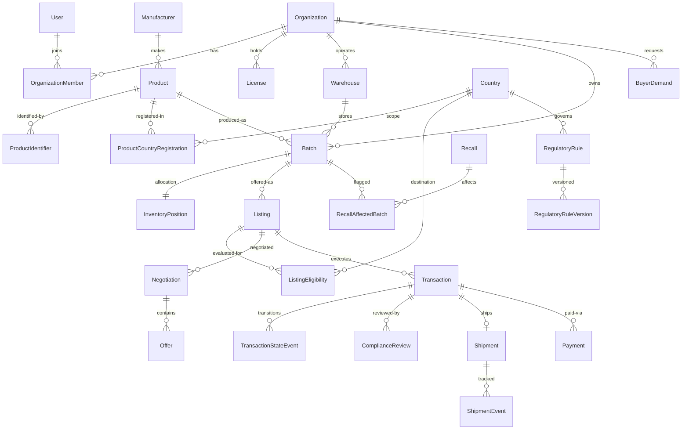

# PART C — Domain Model & Database Schema

**Source of truth:** [`prisma/schema.prisma`](../../prisma/schema.prisma). This document explains the model; the schema file defines it. PostgreSQL 16, UUIDv7 keys, `createdAt/updatedAt` everywhere, soft delete (`deletedAt`) where legally safe, hard retention where legally required.

## 1. Modelling principles

1. **PRODUCT ≠ SKU ≠ BATCH ≠ LISTING.** A `Product` is the abstract medicinal product (INN, strength, form, pack). `ProductIdentifier` holds SKU-level codes (GTIN, PZN, national codes). A `Batch` is a physical lot with expiry and quantity. A `Listing` is a commercial offer of (part of) a batch. Transactions always reference batches.
2. **Versioned regulation.** `RegulatoryRule` is a stable pointer; `RegulatoryRuleVersion` rows are immutable — a change creates a new version that supersedes the old. Nothing is overwritten.
3. **Snapshots for decisions.** Eligibility verdicts, match scores, and transaction economics persist the inputs they used (rule version IDs, engine version, exchange rate) so every historical decision is reconstructable.
4. **Configuration over hardcoding.** Fees, buffers, thresholds, excluded product classes → `PlatformConfig` / per-country columns.
5. **Money = `Decimal`**, currencies ISO-4217, FX rate copied onto the transaction at execution time (never retroactively changed).

## 2. Entity clusters

### Identity & Organizations
| Entity | Critical fields | Notes |
|---|---|---|
| `User` | email (unique), passwordHash (scrypt), platformRole?, locale, mfaEnabled/mfaSecret, status, lastLoginAt | Platform staff get `platformRole` (PLATFORM_ADMIN, COMPLIANCE_OFFICER, REGULATORY_ANALYST); org users get roles via membership. |
| `Session` | tokenHash (SHA-256), expiresAt, ip, userAgent, revokedAt | Opaque token only in cookie; DB row is the authority. |
| `Organization` | kind (SELLER/BUYER/HYBRID/LOGISTICS), legalName, tradingName, regNumber, vatNumber, countryId, status (DRAFT→PENDING_KYB→VERIFIED/REJECTED/SUSPENDED), kybStatus, sanctionsStatus, bankInfo (restricted), beneficialOwners | KYB result + sanctions screening stored, both audit-logged. |
| `OrganizationMember` | userId+orgId (unique), role (OWNER/ADMIN/COMMERCIAL/INVENTORY/COMPLIANCE/FINANCE/VIEWER), status | |
| `License` | orgId, type (WDA/GDP/GMP/IMPORT/MANUFACTURING/HOSPITAL/PHARMACY/OTHER), number, issuingAuthority, countryId, issueDate, **expiryDate**, status (PENDING_REVIEW/VERIFIED/REJECTED/EXPIRED/SUSPENDED), verifiedBy/At | Expiry monitoring; expired/unverified ⇒ regulated actions blocked. |
| `Warehouse` | orgId, address, countryId, capabilities: ambient/cold2to8/frozen/controlledRoom, gdpCompliant | |

### Master data
| Entity | Critical fields |
|---|---|
| `Country` | iso2 (PK), names (en/de/ar), region, isEea, isSupplyEnabled, isDestinationEnabled, **tradeStatus (default NOT_TRADE_ENABLED)**, shippingDays?, customsBufferDays?, operationalBufferDays? (null ⇒ platform defaults) |
| `RegulatoryAuthority` | countryId, name, website, type |
| `Manufacturer` | name, countryId — normalized for recall/counterfeit tracing |
| `Product` | inn, brandName, manufacturerId, mahName, atcCode, strengthValue+unit, dosageForm, routeOfAdministration, packSize+unit, prescriptionStatus, **controlledStatus**, coldChain + storageMin/MaxC, serializationRequired, originalShelfLifeMonths?, status (DRAFT/PENDING_REVIEW/VERIFIED), isDemo |
| `ProductIdentifier` | productId, type (GTIN/PZN/CNK/NTIN/OTHER), value, countryId? |
| `ProductCountryRegistration` | productId+countryId, status (**UNKNOWN default**/REGISTERED/NOT_REGISTERED/PENDING/EXEMPT_POSSIBLE), registrationNumber, source, verifiedAt/By |

### Inventory
| Entity | Critical fields |
|---|---|
| `Batch` | productId, sellerOrgId, warehouseId, lotNumber, manufacturingDate?, **expiryDate**, originalShelfLifeDays? (derived at insert when mfg date known), quantity+unit, packQuantity, temperature fields, packagingLanguage, serializationStatus, **recallStatus / quarantineStatus / qualityStatus (UNVERIFIED default)**, condition fields, isDemo |
| `InventoryPosition` | batchId (unique), onHand, reserved, sold — allocation integrity |

### Regulatory intelligence
| Entity | Critical fields |
|---|---|
| `RegulatoryRule` | countryId, ruleType (SHELF_LIFE/PRODUCT_REGISTRATION/IMPORT_LICENSE/LABELING/SERIALIZATION/CONTROLLED/CUSTOMS/OTHER), currentVersionId |
| `RegulatoryRuleVersion` | ruleId, version, **payload (typed JSONB)**, status (VERIFIED/PENDING_VERIFICATION/OUTDATED/CONFLICTING_SOURCES/REQUIRES_LOCAL_COUNSEL/SUSPENDED/**DEMO**), authorityName, sourceName, sourceUrl, publishedAt, effectiveAt, lastVerifiedAt, verifiedById, confidence (HIGH/MEDIUM/LOW/UNVERIFIED), notes, supersedesVersionId — **immutable, append-only** |
| `RegulatorySource` | countryId, title, url, retrievedAt, documentId? |
| `CountryReadinessScore` | countryId, total 0–100, components JSONB (each: score, weight, note, confidence), computedAt/By, version — components always shown, uncertainty never hidden |
| `ShortageSignal` | source, countryId, productId?/freeText, severity, status, reportedAt, expectedResolution?, confidence, url — only lawful, sourced ingestion |

### Marketplace
| Entity | Critical fields |
|---|---|
| `Listing` | sellerOrgId, batchId, productId (denorm), listingType (SURPLUS/SHORT_DATED), quantityAvailable, minOrderQuantity, unitPrice (Decimal), currency, negotiable, incoterm, visibility (PUBLIC_VERIFIED/COUNTRY_RESTRICTED/INVITE_ONLY/PRIVATE), anonymousSeller, status (DRAFT/PENDING_COMPLIANCE/ACTIVE/PAUSED/SOLD_OUT/WITHDRAWN/BLOCKED), complianceStatus |
| `ListingEligibility` | listingId+countryId, verdict, reasons JSONB, requiredDocuments/Permits JSONB, arrivalShelfLifeDays/Percent, requiresHumanReview, engineVersion, ruleVersionIds JSONB, evaluatedAt — cached engine output |
| `BuyerDemand` | buyerOrgId, productId? + freeText (inn/strength/form), quantity+unit, destinationCountryId, requiredBy, maxUnitPrice?, currency, minRemainingShelfLifeMonths?, coldChainRequired, monthlyConsumptionUnits? (consumption feasibility), status, visibility |
| `Match` | listingId?/demandId?, batchId, sellerOrgId, buyerOrgId, score, scoreBreakdown JSONB, eligibilitySnapshot JSONB, status |
| `Negotiation` | listingId?/demandId?, sellerOrgId, buyerOrgId, status |
| `Offer` | negotiationId, direction, quantity, unitPrice, currency, incoterm, requestedDeliveryDate, conditions, status (SUBMITTED/COUNTERED/ACCEPTED/REJECTED/WITHDRAWN/EXPIRED), parentOfferId (counter chain), expiresAt — full history preserved |

### Transactions & compliance ops
| Entity | Critical fields |
|---|---|
| `Transaction` | listingId, batchId, sellerOrgId, buyerOrgId, destinationCountryId, **state (see PART E)**, quantity, unitPrice, currency, fxRateToEur (copied), economics: subtotal/commissionRate/commissionAmount/logisticsCost/insuranceCost/customsEstimate/taxEstimate/paymentFees/buyerLandedCost/sellerPayout/platformRevenue (all Decimal), eligibilitySnapshot JSONB |
| `TransactionItem` | transactionId, batchId, quantity, unitPrice — multi-batch ready |
| `TransactionStateEvent` | transactionId, fromState, toState, actorUserId?, actorType (USER/SYSTEM/COMPLIANCE), reason, metadata JSONB — every transition logged |
| `ComplianceReview` | type (KYB/LICENSE/PRODUCT/LISTING/TRANSACTION/COUNTRY_RULE), subject FKs, status (PENDING/IN_REVIEW/APPROVED/REJECTED/NEEDS_DOCUMENTS), priority, assignedToId, decision, decisionReason, checklist JSONB |
| `ImportPermit` | buyerOrgId, countryId, productId?, transactionId?, permitNumber, issue/expiry, status, documentId |

### Documents, logistics, payments
| Entity | Critical fields |
|---|---|
| `Document` | ownerOrgId, type (string code from registry), fileName, mimeType, sizeBytes, storageKey, **sha256**, status (UPLOADED/VERIFIED/REJECTED), issuer, issueDate, expiryDate?, links: countryId/productId/batchId/licenseId/transactionId/shipmentId, uploadedById — access is permission-checked, never public |
| `Shipment` | transactionId, originWarehouseId, destination fields, carrier, incoterm, **temperatureMode (AMBIENT/COLD_2_8/FROZEN/CRT)**, temperatureMonitoringRequired, dangerousGoods, pickupDate?, estimatedArrival?, actualArrival?, trackingNumber, awb, status, customsStatus |
| `ShipmentEvent` | shipmentId, type, occurredAt, location, data JSONB |
| `TemperatureLog` | shipmentId, recordedAt, temperatureC (Decimal), source |
| `Payment` | transactionId, provider, providerRef, state (PENDING/AUTHORIZED/HELD/PAID/RELEASED/REFUNDED/FAILED/DISPUTED), amount, currency |
| `Invoice` | transactionId, number, type (BUYER_INVOICE/SELLER_SELF_BILL/COMMISSION), amounts, currency, issuedAt, documentId |
| `Payout` | transactionId, sellerOrgId, amount, currency, state, executedAt |
| `ExchangeRate` | base, quote, rate (Decimal), source, asOf |
| `PricingReference` | productId, countryId?, priceType, price, currency, source, asOf, confidence — empty until real sources exist ("insufficient pricing data" in UI) |

### Safety, audit, platform
| Entity | Critical fields |
|---|---|
| `SanctionsCheck` | subjectType (ORG/USER/BANK/COUNTRY/ROUTE), subjectId, provider (MANUAL in MVP), result (CLEAR/REVIEW/BLOCKED), payload JSONB, checkedAt/By, expiresAt |
| `Recall` | productId?/manufacturerId?, scope, source, sourceUrl, status (ACTIVE/RESOLVED), issuedAt |
| `RecallAffectedBatch` | recallId, batchId, status (QUARANTINED/RETURNED/DESTROYED) |
| `AuditLog` | actorUserId?, actorType, orgId?, action, entityType, entityId, oldValue/newValue JSONB, reason, ip, sessionId — **append-only, DB-level UPDATE/DELETE blocked by trigger** |
| `Notification` | userId, orgId?, type, title, body, data JSONB, channel (IN_APP/EMAIL), readAt? |
| `PlatformConfig` | key (unique), value JSONB, updatedById — commission %, buffers, thresholds, excluded product classes, demo mode |

## 3. Core relationship diagram

## 4. Retention & GDPR split

- **User profile data** (name, email, sessions) → deletable/anonymizable on request.
- **Regulated trade records** (transactions, batches, compliance decisions, audit log) → retained per pharmaceutical/commercial law; account deletion anonymizes the user reference but never removes the trade record. See PART M §GDPR.
