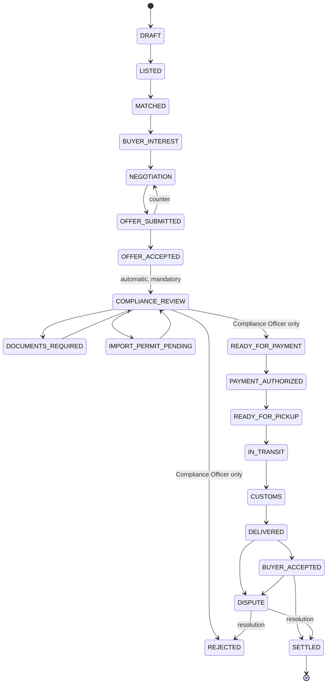

# PART E — Marketplace Workflow & Transaction State Machine

## 1. End-to-end flow

```
SELLER                    PLATFORM                                   BUYER
──────                    ────────                                   ─────
KYB + licenses  ────────► Compliance verifies org/licenses ◄──────── KYB + licenses + import permits
Upload batches  ────────► Batch data + documents + quality status
Create listing  ────────► Eligibility Engine evaluates listing
                          against ALL destination countries
                          → ListingEligibility snapshots
                          → compliance check → ACTIVE
                                                    Marketplace visibility filtered:
                                                    buyer only sees legally purchasable
                                                    inventory  ◄────── search / RFQ (BuyerDemand)
                          Matching engine proposes matches (both directions:
                          supply→demand and demand→supply), scored
Receive offer  ◄───────── Negotiation (offer/counter chain) ◄──────── submit offer
accept/counter ─────────► OFFER_ACCEPTED
                          ═══ COMPLIANCE_REVIEW (human gate) ═══
                          documents / import permit loop as needed
                          Compliance approves → READY_FOR_PAYMENT
                          Payment authorized (provider abstraction)
Prepare pickup ─────────► Shipment: pickup → transit → customs → delivered
                                                    Buyer confirms receipt
                          Settlement: seller payout + platform commission
                          Full audit trail end-to-end
```

## 2. Transaction state machine

States (enum `TransactionState`):

`DRAFT, LISTED, MATCHED, BUYER_INTEREST, NEGOTIATION, OFFER_SUBMITTED, OFFER_ACCEPTED, COMPLIANCE_REVIEW, DOCUMENTS_REQUIRED, IMPORT_PERMIT_PENDING, READY_FOR_PAYMENT, PAYMENT_AUTHORIZED, READY_FOR_PICKUP, IN_TRANSIT, CUSTOMS, DELIVERED, BUYER_ACCEPTED, SETTLED, CANCELLED, REJECTED, QUARANTINED, RECALL, DISPUTE`



### Guards (enforced in `src/domain/transactions/state-machine.ts`)

| Transition | Guard |
|---|---|
| every forward transition | batch not recalled/quarantined; org not suspended |
| → LISTED | seller org VERIFIED, license VERIFIED & unexpired, listing compliance passed |
| → OFFER_ACCEPTED | offer valid, quantity ≤ available (reservation) |
| COMPLIANCE_REVIEW → READY_FOR_PAYMENT | **actor = platform COMPLIANCE_OFFICER**; all required docs verified; permit verified if required; sanctions CLEAR; licenses still valid |
| → READY_FOR_PICKUP | payment authorized |
| → IN_TRANSIT | shipment booked; projected arrival still satisfies destination shelf-life rule (re-checked!) |
| CANCELLED | allowed from any state before READY_FOR_PICKUP, by involved party or compliance, reason mandatory |
| QUARANTINED / RECALL | from any non-terminal state, by compliance/system, immediately freezes the flow |

Terminal states: `SETTLED, CANCELLED, REJECTED` (+ `RECALL` resolves into return/destruction workflow). Every transition writes `TransactionStateEvent` + `AuditLog`.

## 3. Negotiation

Offer chains under a `Negotiation`: buyer submits (quantity, unit price, incoterm, delivery date, conditions) → seller accepts / rejects / counters (`parentOfferId` chain). Full history immutable. Accepting any offer supersedes open siblings.

## 4. Visibility rules

Marketplace queries always join `ListingEligibility` for the buyer org's country and filter to `ELIGIBLE`/`CONDITIONALLY_ELIGIBLE` (conditional shows requirements, purchase gated), respect listing visibility (PUBLIC_VERIFIED / COUNTRY_RESTRICTED / INVITE_ONLY / PRIVATE), and require buyer org status VERIFIED. `INELIGIBLE` destinations never see an actionable purchase control.

## 5. Deal room (Phase 4)

Per transaction: participants, offer history, documents, compliance status, chat, shipment, payment, timeline, tasks, approvals — one screen per deal with complete timeline.
